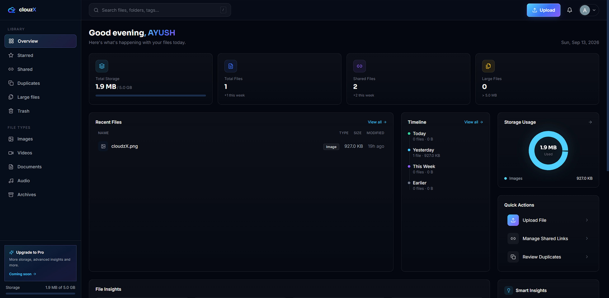

# clouzX

Your files, understood. A premium, full-stack cloud storage app with a dark glass UI, AI-powered file intelligence, and secure sharing.



## Features

- Email/password or one-tap Google sign-in
- Drag-and-drop upload to Cloudinary (50MB/file, configurable quota)
- **Timeline** — files grouped into Today, Yesterday, This Week, Earlier
- **Smart file intelligence** — auto-tagging and insights via Groq, with a heuristic fallback
- **Share links** — public links with view/download permission, expiry, revoke, and view counter
- **Duplicate detection** — SHA-256 hashing surfaces reclaimable storage (nothing auto-deleted)
- **Large files & storage dashboard** — size breakdown, categories, and duplicate summaries
- Star, trash, restore, and permanent delete with an in-app confirm dialog
- Fully responsive, with round profile avatar (Google photo or initial fallback)

## Stack

**Backend:** Node, Express, MongoDB (Mongoose), JWT + Google OAuth, Cloudinary, Multer, Groq (native `fetch`)
**Frontend:** React (Vite), Tailwind CSS, React Router, Framer Motion, Recharts, Axios

## Setup

1. **Cloudinary** — free account at [cloudinary.com](https://cloudinary.com), copy Cloud Name, API Key, API Secret
2. **Google OAuth** — [console.cloud.google.com/apis/credentials](https://console.cloud.google.com/apis/credentials), create a Web OAuth Client ID, add `http://localhost:5173` as an authorized origin
3. **Groq** (optional) — free key at [console.groq.com](https://console.groq.com); leave blank to use heuristic tagging
4. **MongoDB** — free cluster at [MongoDB Atlas](https://mongodb.com/atlas), copy the connection string

### Backend

```bash
cd backend
npm install
cp .env.example .env   # fill in MONGO_URI, JWT_SECRET, CLOUDINARY_*, GOOGLE_CLIENT_ID, GROQ_API_KEY, CLIENT_URL
npm run dev             # http://localhost:5000
```

### Frontend

```bash
cd frontend
npm install
cp .env.example .env   # fill in VITE_API_URL, VITE_GOOGLE_CLIENT_ID
npm run dev             # http://localhost:5173
```

## API overview

All routes prefixed with `/api`.

| Area | Routes |
|---|---|
| **Auth** (`/auth`) | `POST /register`, `/login`, `/google`, `/logout` · `GET /me` |
| **Files** (`/files`, auth required) | `POST /upload` · `GET /`, `/timeline`, `/trash`, `/duplicates`, `/large`, `/shared`, `/stats` · `PATCH /:id/trash`, `/:id/restore`, `/:id/star` · `DELETE /:id` · `POST /:id/share` · `DELETE /:id/share` |
| **Public** (`/public`) | `GET /share/:token` — resolves a public share link (expiry-aware, increments view count) |

## Deployment

- **Backend → Render**: set all env vars from `.env.example`, including `GROQ_API_KEY`; set `CLIENT_URL` to your deployed frontend.
- **Frontend → Vercel**: set `VITE_API_URL` (with `/api` suffix) and `VITE_GOOGLE_CLIENT_ID`.
- Add your deployed frontend URL as an authorized JavaScript origin in Google Cloud Console.
# CI/CD automated test
automation test

CI/CD automation demo
